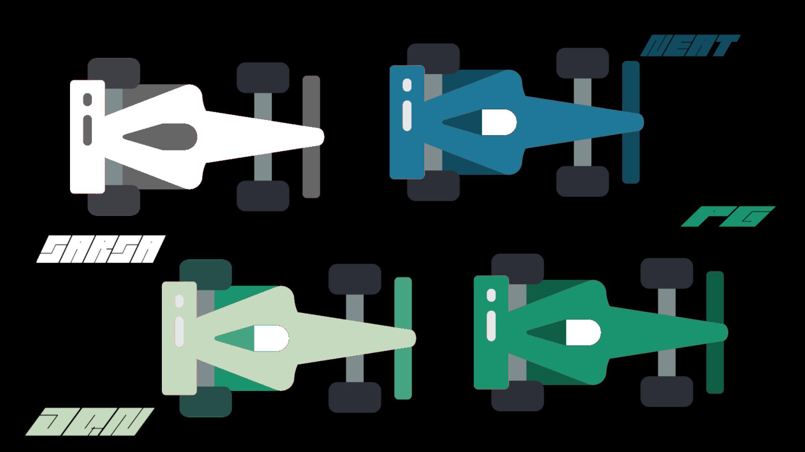

# RAICE 🤖🏎️🏁

(STILL ON DEVELOPMENT)

  

## INTRODUCTION

RL agents are trained on a custom made racing game. The goal is train multiple algorithms to race on the same tracks and see which one is the best across all F1 tracks.

## CURRENT ALGORITHMS STANDINGS

  

## RACING CAR-ALGORITHMS

  

## ACTUAL RAICE
[Videograbación 2024-09-10 21 21 56.webm](https://github.com/user-attachments/assets/b481bb0c-597f-45b9-bc89-17f69aa6b9c3) 

## CURRENT MAPS

| TRACK | IMAGE | READY |
|----------|----------|----------|
| 🇧🇭 BAHREIN |  | YES |

