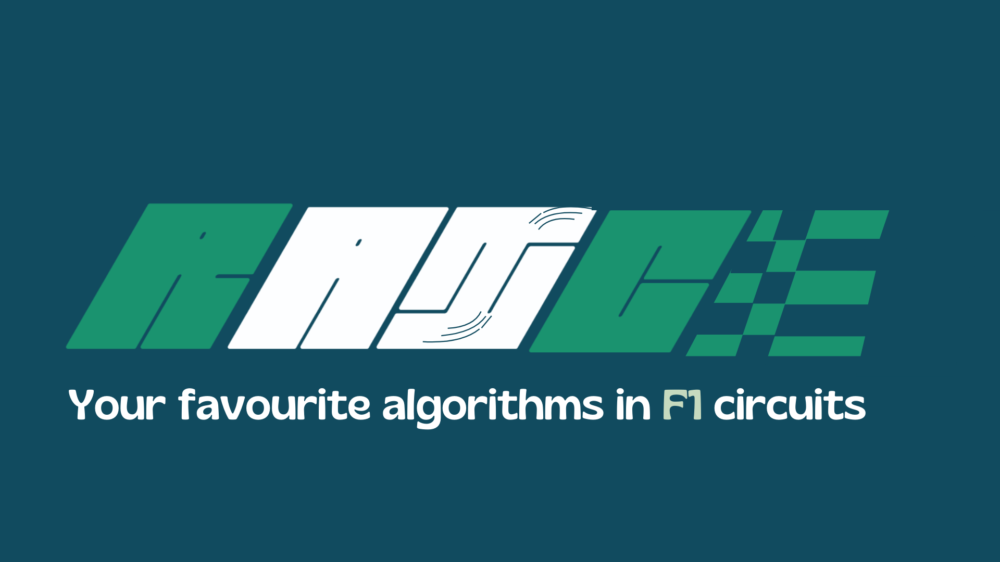
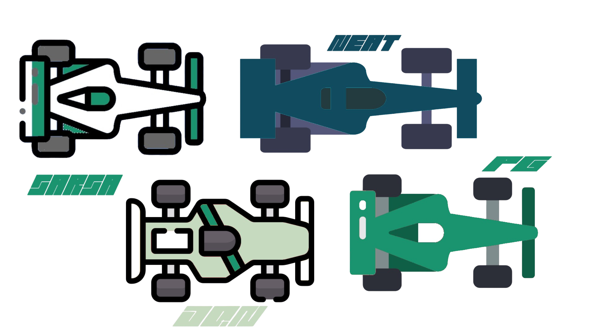
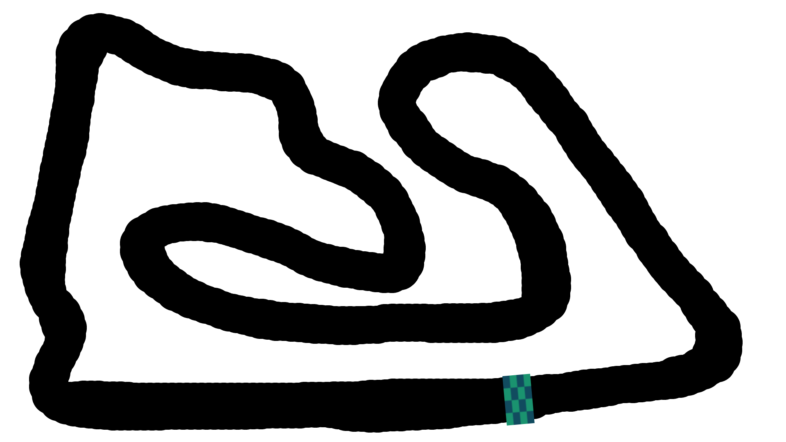

# RAICE 🤖🏎️🏁

(STILL ON DEVELOPMENT)

  

## INTRODUCTION

RL agents are trained on a custom made racing game. The goal is train multiple algorithms to race on the same tracks and see which one is the best across all F1 tracks.

## RACING CAR-ALGORITHMS

  

- `Blue Cars`: Correspond to Policy-Based Algorithms (e.g., Proximal Policy Optimization, PPO). These agents learn a policy directly by optimizing the expected return, focusing on selecting the best action in each state.

- `Green Cars`: Represent Value-Based Algorithms (e.g., Deep Q-Learning, DQN). These agents learn to estimate the value of actions and states, aiming to improve decision-making based on long-term expected rewards.

- `Both Colors (Blue + Green)`: These cars utilize Hybrid Algorithms that combine both policy-based and value-based approaches, such as Actor-Critic methods, where one part learns the policy and another learns the value function.

- `White Cars`: Indicate the use of a Genetic Algorithm. These cars evolve over time through selection, mutation, and crossover, mimicking natural evolution to optimize their behavior. 

## RAICE EXAMPLE
[Videograbación 2024-09-10 21 21 56.webm](https://github.com/user-attachments/assets/b481bb0c-597f-45b9-bc89-17f69aa6b9c3) 

## CURRENT MAPS

| TRACK | IMAGE | READY |
|----------|----------|----------|
| 🇧🇭 BAHREIN |  | YES |

